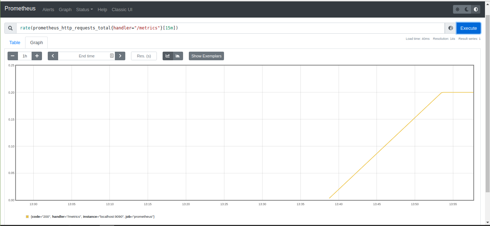
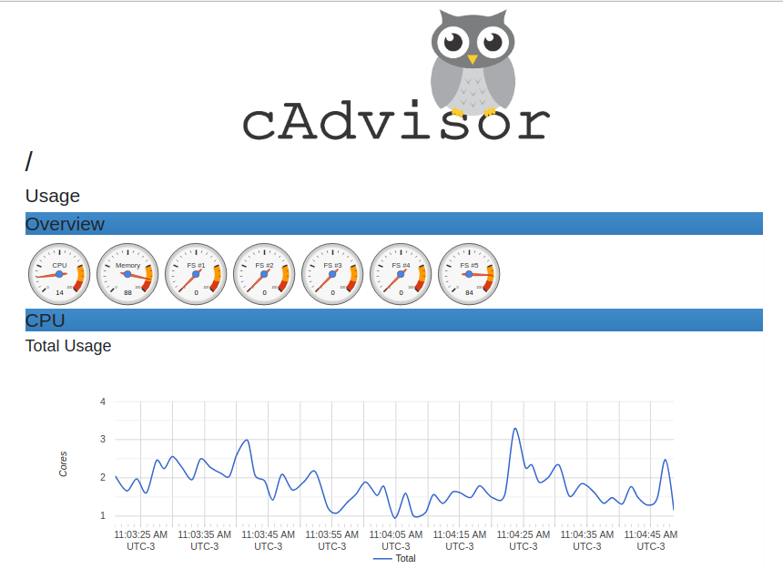
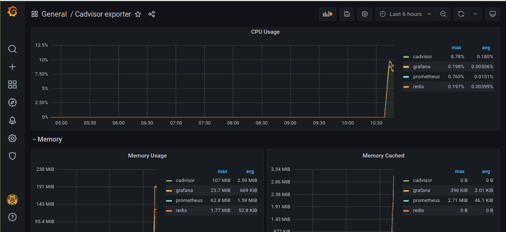

# full-cycle-2.0-prometheus

Files I produced during the "Observability / Prometheus" classes of my microservices course.

## Prometheus

Access http://localhost:9090.

If you wanna see prometheus metrics of itself, access http://localhost:9090/metrics.

Example of a graph I created to track the number of requests prometheus made to its /metrics endpoint:



## Cadvisor

Access http://localhost:8080/metrics

Docker containers metrics of your machine from cadvisor



## Grafana

Access http://localhost:3000

User: admin, Pass: admin

Import cadvisor dashboard, id: 14282



## Golang application

Enter inside the Golang application container

```sh
docker-compose exec app bash
```

Run these commands:

```sh
go get github.com/prometheus/client_golang/prometheus
go get github.com/prometheus/client_golang/prometheus/promhttp

go run main.go
```

Open another terminal outside the container and run:

```sh
for i in {1..20}; do curl localhost:8181; done  # Run curl 20 times
curl localhost:8181/metrics
```

The output should be similar to:

```
# HELP goapp_http_request_duration Duration in seconds of all HTTP requests
# TYPE goapp_http_request_duration histogram
goapp_http_request_duration_bucket{handler="Home",le="0.005"} 20
goapp_http_request_duration_bucket{handler="Home",le="0.01"} 20
goapp_http_request_duration_bucket{handler="Home",le="0.025"} 20
goapp_http_request_duration_bucket{handler="Home",le="0.05"} 20
goapp_http_request_duration_bucket{handler="Home",le="0.1"} 20
goapp_http_request_duration_bucket{handler="Home",le="0.25"} 20
goapp_http_request_duration_bucket{handler="Home",le="0.5"} 20
goapp_http_request_duration_bucket{handler="Home",le="1"} 20
goapp_http_request_duration_bucket{handler="Home",le="2.5"} 20
goapp_http_request_duration_bucket{handler="Home",le="5"} 20
goapp_http_request_duration_bucket{handler="Home",le="10"} 20
goapp_http_request_duration_bucket{handler="Home",le="+Inf"} 20
goapp_http_request_duration_sum{handler="Home"} 0.00023509399999999996
goapp_http_request_duration_count{handler="Home"} 20
# HELP goapp_http_requests_total Count of all http requests for goapp
# TYPE goapp_http_requests_total counter
goapp_http_requests_total 20
# HELP goapp_online_users Online users
# TYPE goapp_online_users gauge
goapp_online_users{logged_users="true"} 1375
```
